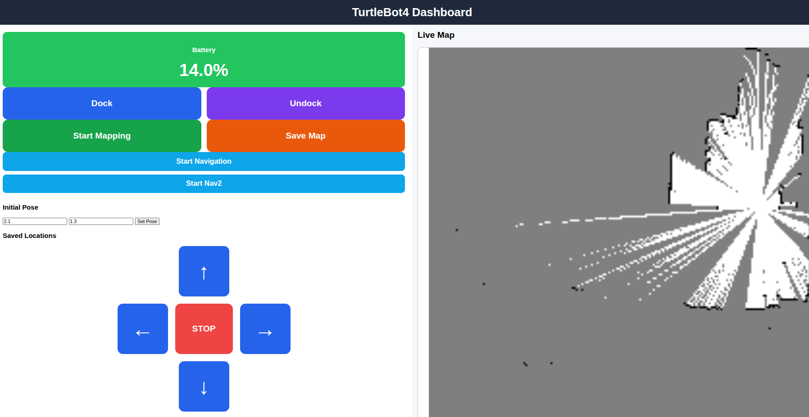
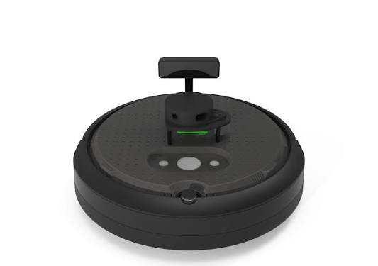

# TurtleBot4 Flask Web Dashboard

A lightweight web-based control dashboard for **TurtleBot4** built using **Flask** and **ROS2 Humble**.

The dashboard allows remote robot control from any device on the same network through a browser, without requiring direct terminal access.


<div align="center">

</div>


---

## Features

### Teleoperation

Control the TurtleBot4 using on-screen buttons:

- Forward
- Backward
- Left
- Right
- Stop

Supports:

- Mouse control
- Touchscreen control
- Continuous movement while holding buttons

<div align="center">

</div>


### Keyboard Control

Use keyboard shortcuts directly from the browser:

| Key | Action |
|-------|---------|
| W | Forward |
| A | Left |
| S | Backward |
| D | Right |
| Space | Stop |

---

### Battery Monitoring

Displays live TurtleBot4 battery percentage by subscribing to:

```text
/battery_state
```

Battery updates automatically on the webpage without requiring a page refresh.

---

### Docking Controls

Provides quick access to:

- Dock
- Undock

for autonomous charging operations.

---

# Mapping

The dashboard supports **live SLAM mapping** using **slam_toolbox**.

Users can:

- Start mapping directly from the web interface
- Drive the robot manually while building the map
- View the generated occupancy grid in real time
- Save the completed map to disk


---

# Navigation

The dashboard supports autonomous navigation using Nav2.

-Start Localization
-Load a previously saved map by clicking:
-Start Navigation

The dashboard launches:

ros2 launch turtlebot4_navigation localization.launch.py \
map:=/home/user/maps/web_map.yaml

This starts:

-Map Server
-AMCL Localization
-Transform Tree
-Start Nav2

Click:

## Start Nav2

The dashboard launches:

ros2 launch turtlebot4_navigation nav2.launch.py

This starts:

Planner Server
Controller Server
Recovery Behaviors
Behavior Tree Navigator
Initial Pose

Before navigation can begin, the robot's position must be initialized.

The dashboard publishes:

/initialpose

Message type:

geometry_msgs/msg/PoseWithCovarianceStamped

Example:

X = 0.0
Y = 0.0

---

## System Architecture

```text
┌─────────────┐
│ Web Browser │
└──────┬──────┘
       │ HTTP Requests
       ▼
┌─────────────┐
│ Flask App   │
└──────┬──────┘
       │ ROS2 Publisher
       ▼
┌─────────────┐
│  /cmd_vel   │
└──────┬──────┘
       ▼
┌─────────────┐
│ TurtleBot4  │
└─────────────┘
```

Battery monitoring:

```text
TurtleBot4
    │
    ▼
 /battery_state
    │
    ▼
 Flask Subscriber
    │
    ▼
 Web Dashboard
```

---

## Requirements

### Hardware

- TurtleBot4
- Laptop/PC
- Common Wi-Fi Network


<div align="center">

</div>


### Software

- Ubuntu 22.04
- ROS2 Humble
- Python 3

---

## Dependencies

Install Flask:

```bash
pip install flask
```

Install ROS2 packages:

```bash
sudo apt install ros-humble-desktop
```

---

## ROS Configuration

Ensure both the laptop and TurtleBot4 are using the same ROS Domain ID.

Example:

```bash
export ROS_DOMAIN_ID=0
```

Verify communication:

```bash
ros2 topic list
```

You should see topics such as:

```text
/cmd_vel
/battery_state
/odom
/scan
```

---

## Setup Instructions

### 1. Install Required ROS2 Packages on the Laptop

Update packages:

```bash
sudo apt update
```

Install TurtleBot4 desktop packages:

```bash
sudo apt install ros-humble-turtlebot4-desktop
```

Install teleoperation package:

```bash
sudo apt install ros-humble-teleop-twist-keyboard
```

Install navigation packages:

```bash
sudo apt install ros-humble-turtlebot4-navigation
```

---

### 2. Connect to TurtleBot4

Find the TurtleBot4 IP address:

```bash
arp -a
```

Example:

```text
192.168.254.115
```

SSH into the robot:

```bash
ssh ubuntu@192.168.254.115
```

Default username:

```text
ubuntu
```

---

### 3. Configure TurtleBot4 Network

Run the TurtleBot4 setup utility:

```bash
turtlebot4-setup
```

Configure the TurtleBot4 to connect to the **same Wi-Fi network** as the laptop.

Both devices must be connected to the same network for ROS2 communication.

---

### 4. Verify ROS2 Communication Settings

Ensure both the laptop and TurtleBot4 use the same:

#### ROS Domain ID

Check:

```bash
echo $ROS_DOMAIN_ID
```

Example:

```bash
export ROS_DOMAIN_ID=0
```

The value must match on both systems.

---

#### DDS Implementation

Check:

```bash
echo $RMW_IMPLEMENTATION
```

Recommended:

```text
rmw_fastrtps_cpp
```

Set if required:

```bash
export RMW_IMPLEMENTATION=rmw_fastrtps_cpp
```

The DDS implementation must match on both the laptop and TurtleBot4.

---

### 5. Verify ROS2 Connectivity

On the laptop:

```bash
ros2 topic list
```

You should see TurtleBot4 topics such as:

```text
/battery_state
/odom
/cmd_vel
/scan
/tf
/tf_static
```

If these topics are visible, the laptop is successfully communicating with the TurtleBot4.

---

## Running the Dashboard

Source ROS2:

```bash
source /opt/ros/humble/setup.bash
```

Run the Flask server:

```bash
python3 app.py
```

Expected output:

```text
Running on http://0.0.0.0:5000
```

Open the dashboard:

```text
http://<laptop-ip>:5000
```

Example:

```text
http://192.168.240.117:5000
```

---

## ROS Topics Used

### Published

```text
/cmd_vel
```

Message Type:

```text
geometry_msgs/msg/Twist
```

Used for robot movement commands.

---

### Subscribed

```text
/battery_state
```

Message Type:

```text
sensor_msgs/msg/BatteryState
```

Used for live battery monitoring.

---

## Project Structure

```text
web_control/
│
├── app.py
│
├── templates/
│   └── index.html
│
├── static/
│   └── style.css
│
└── README.md
```

---

## Future Improvements

- Live Camera Feed
- Dock Status Monitoring
- Robot Pose Display
- Live Map Visualization
- Click-to-Navigate Goals
- Navigation Status
- Emergency Stop
- Multi-Robot Support
- Mobile Responsive Interface

---

## Screenshot

```text
┌─────────────────────────────┐
│     TurtleBot4 Dashboard    │
└─────────────────────────────┘

┌─────────────────────────────┐
│ Battery Status              │
│                             │
│          83.4 %             │
└─────────────────────────────┘

┌─────────────────────────────┐
│ Teleoperation               │
│             ↑               │
│                             │
│      ←   STOP   →           │
│                             │
│             ↓               │
└─────────────────────────────┘

┌─────────────────────────────┐
│ Docking Controls            │
│                             │
│ [ Dock ] [ Undock ]         │
└─────────────────────────────┘
```

---

## Author

Pulkit Garg

Robotics | ROS2 | Autonomous Systems | Computer Vision